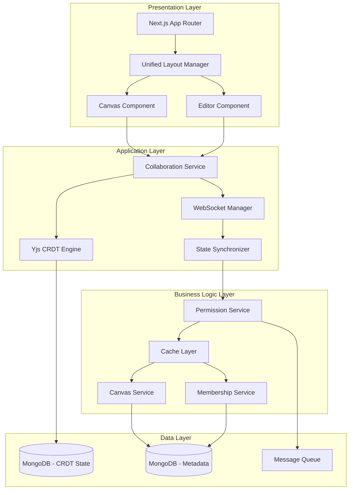
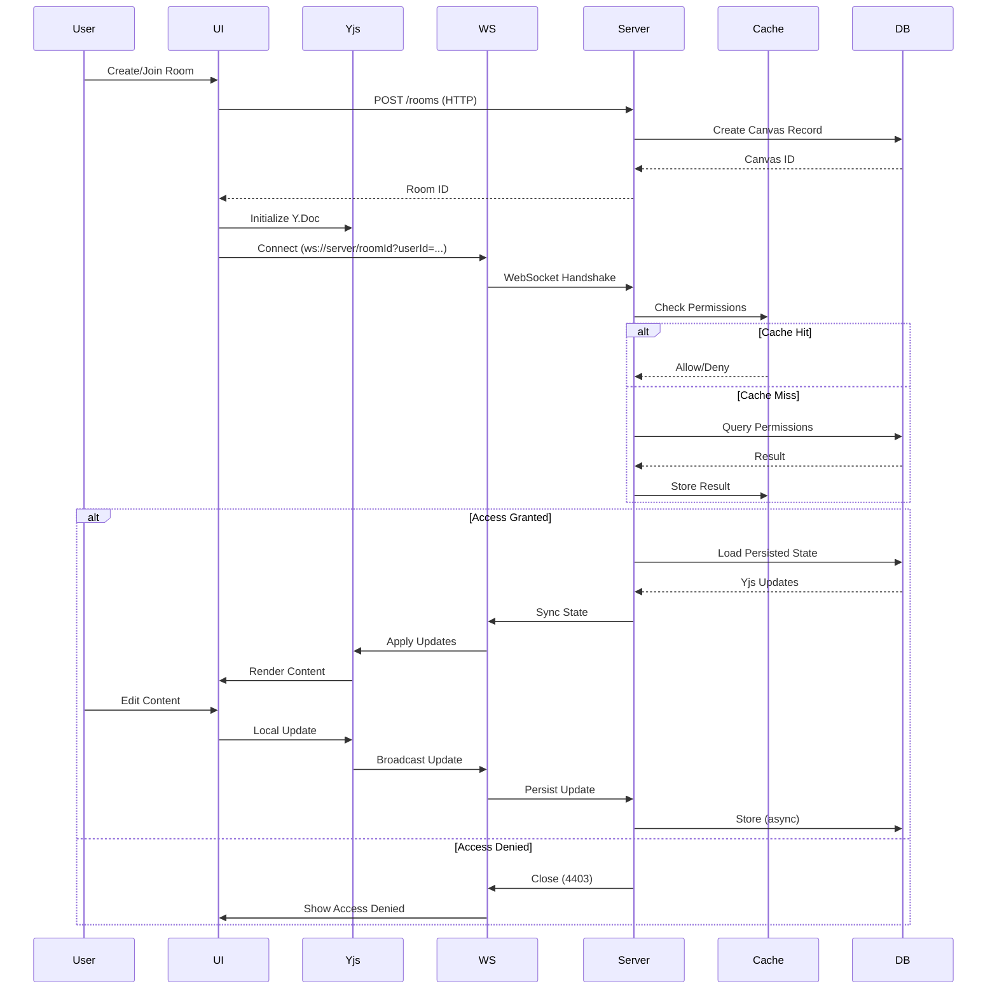
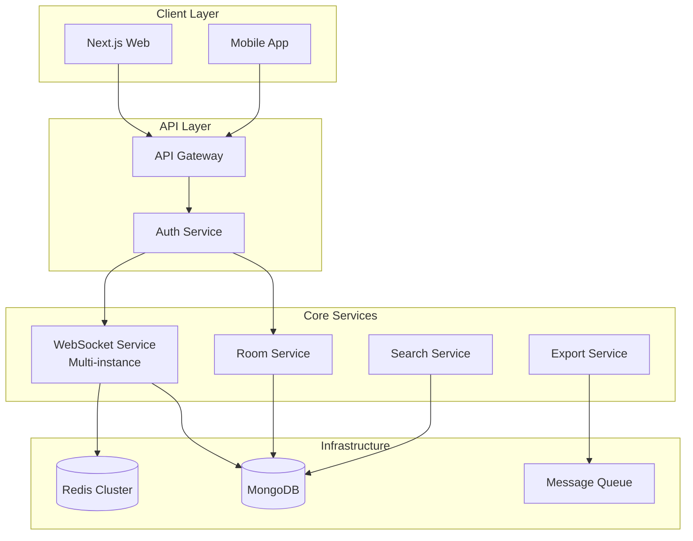

# System Design & Architecture Analysis

## Executive Summary

This document provides a comprehensive system design for a collaborative canvas + document editor (Eraser.io-like application). The analysis covers:
- Current architecture and implementation
- Performance bottlenecks and issues
- Recommended system design
- Best practices and anti-patterns
- Scalability considerations

---

## 📊 Current Architecture Overview

### Technology Stack

#### **Frontend** (Next.js Application)
```
├── Framework: Next.js 16 (React 19)
├── Canvas: Excalidraw (@excalidraw/excalidraw)
├── Editor: BlockNote (@blocknote/core, @blocknote/react)
├── Real-time Sync: Yjs + y-websocket
├── Authentication: Clerk
├── Styling: Tailwind CSS v4
└── State Management: React Context (RoomContext, CanvasContext)
```

#### **Backend** (Node.js Server)
```
├── Runtime: Node.js (ES Modules)
├── Framework: Express 5
├── WebSocket: ws + @y/websocket-server
├── Database: MongoDB (via Mongoose)
├── Persistence: y-mongodb-provider
└── CRDT: Yjs
```

### High-Level Architecture

```mermaid
graph TB
    subgraph "Client Layer"
        A[Next.js App]
        B[Excalidraw Canvas]
        C[BlockNote Editor]
        D[Yjs CRDT]
    end
    
    subgraph "Network Layer"
        E[WebSocket Connection]
        F[HTTP REST API]
    end
    
    subgraph "Server Layer"
        G[Express + WS Server]
        H[@y/websocket-server]
        I[Permission Service]
    end
    
    subgraph "Data Layer"
        J[(MongoDB)]
        K[y-mongodb-provider]
        L[Canvas/Room Models]
    end
    
    A --> B
    A --> C
    B --> D
    C --> D
    D --> E
    A --> F
    E --> G
    F --> G
    G --> H
    G --> I
    H --> K
    I --> J
    K --> J
    G --> L
    L --> J
```

---

## 🔴 Current Performance Issues & Root Causes

### 1. **Excessive Re-renders and Component Mounting**

**Issue**: Components mount multiple times unnecessarily
- `Whiteboard.tsx` and `Editor.tsx` both commented out sync checks
- Components render before WebSocket sync completes
- Multiple Context providers create render cascades

**Impact**: 
- Empty canvas overwrites persisted data
- Multiple binding creations/destructions
- Wasted render cycles

**Root Cause**:
```tsx
// ❌ BAD: No loading state, causes premature renders
// Removed blocking check for "optimistic loading"
// if (!provider || !isSynced) {
//     return <div>Loading...</div>;
// }
```

### 2. **Memory Leaks in Yjs Bindings**

**Issue**: Multiple `ExcalidrawBinding` instances created without proper cleanup

**Location**: `Whiteboard.tsx` lines 43-62
```tsx
useEffect(() => {
    if (!api || !excalidrawRef.current || !provider) return;
    
    const binding = new ExcalidrawBinding(...);
    setBindings(binding);
    
    return () => {
        setBindings(null);
        binding.destroy(); // ✅ Cleanup exists but...
    };
}, [api, yElements, yAssets, provider]);
```

**Problem**: Dependencies array includes `yElements` and `yAssets` which are stable references, BUT the effect re-runs on every provider change, creating multiple bindings.

### 3. **Inefficient Deep Observation**

**Issue**: Deep observation on entire Yjs array with debounced logging

**Location**: `Whiteboard.tsx` lines 68-85
```tsx
useEffect(() => {
    const logElements = debounce(() => {
        const current = yElements.toArray().map((item) => item.toJSON());
        const serialized = JSON.stringify(current); // ❌ Expensive
        // ...
    }, 1500);
    
    yElements.observeDeep(logElements); // ❌ Observes EVERYTHING
}, [yElements]);
```

**Impact**:
- Every element change triggers serialization of entire array
- JSON.stringify on large documents is very slow
- Debug code left in production

### 4. **Race Conditions in Initialization**

**Issue**: Multiple initialization paths creating conflicts

**Problematic Flow**:
```tsx
// Editor.tsx - initializes with possibly stale data
const editor = useCreateBlockNote({
    collaboration: provider ? {
        provider,
        fragment: ydoc.getXmlFragment("document-store"),
    } : undefined,
});

// Whiteboard.tsx - tries to sync from Yjs state
useEffect(() => {
    if (!api || !binding) return;
    const elements = yjsToExcalidraw(yElements);
    if (elements && elements.length > 0) {
        api.updateScene({ elements }); // ⚠️ May conflict
    }
}, [api, binding, yElements]);
```

### 5. **Unoptimized Context Architecture**

**Issue**: Nested context providers cause cascading updates

**Current Structure**:
```tsx
<RoomProvider> 
  └─ <CanvasProvider>
      └─ <RoomContextBridge>
          └─ Components that use both contexts
```

**Problem**:
- Double wrapping for backward compatibility
- Any state change in CanvasContext triggers RoomContext update
- All consuming components re-render

### 6. **Missing WebSocket Connection Pooling**

**Issue**: Each room creates a new WebSocket connection
- No connection reuse or pooling
- No reconnection backoff strategy
- Memory buildup with multiple tabs/rooms

### 7. **Database Query Inefficiencies**

**Issue**: Missing indexes and optimizations

**Backend Issues**:
```javascript
// ❌ No compound indexes for common queries
// CanvasMember lookups by (canvasId, userId) not optimized
await CanvasMember.findOne({ canvasId, userId });

// ❌ No caching for permission checks
// Every WebSocket connection queries database
const hasAccess = await canAccess(roomName, userId);
```

### 8. **Synchronous MongoDB Operations in Hot Path**

**Issue**: Blocking database calls in WebSocket connection handler

**Location**: `backend/index.js` lines 120-156
```javascript
wss.on("connection", async (conn, req) => {
    // ❌ Blocking permission check on every connection
    const hasAccess = await canAccess(roomName, userId);
    
    // ❌ Blocking membership tracking
    if (userId) {
        addCollaborator(roomName, userId).catch(...);
    }
});
```

**Impact**: WebSocket connections wait for DB queries before sync starts

---

## ✅ Recommended System Architecture

### 1. **Optimized Component Lifecycle**

```tsx
// ✅ GOOD: Wait for sync before rendering
export default function Whiteboard({ roomId }: { roomId: string }) {
    const { provider, ydoc, isSynced } = useRoom();
    const [api, setApi] = useState<ExcalidrawImperativeAPI | null>(null);
    
    // Don't render until synced
    if (!provider || !isSynced) {
        return <div className="flex items-center justify-center h-full">
            <Spinner /> Syncing canvas...
        </div>;
    }
    
    return <ExcalidrawCanvas />;
}
```

### 2. **Single Context Provider Pattern**

```tsx
// ✅ GOOD: Flatten context hierarchy
export function CollaborationProvider({ roomId, userId, children }) {
    const [state, setState] = useState({
        provider: null,
        ydoc: new Y.Doc(),
        isSynced: false,
        accessDenied: false,
    });
    
    // Single provider with memoized value
    const value = useMemo(() => state, [state]);
    
    return (
        <CollaborationContext.Provider value={value}>
            {children}
        </CollaborationContext.Provider>
    );
}
```

### 3. **Optimized Yjs Integration**

```tsx
// ✅ GOOD: Create binding once with stable dependencies
const binding = useMemo(() => {
    if (!api || !provider) return null;
    
    return new ExcalidrawBinding(
        yElements,
        yAssets,
        api,
        provider.awareness,
        {
            excalidrawDom: excalidrawRef.current,
            undoManager: new Y.UndoManager([yElements, yAssets]),
        }
    );
}, [api, provider]); // ✅ Only recreate when API or provider changes

useEffect(() => {
    return () => binding?.destroy();
}, [binding]);
```

### 4. **Efficient Observation Pattern**

```tsx
// ✅ GOOD: Targeted observation with throttling
useEffect(() => {
    if (!yElements) return;
    
    let frameId: number;
    const observer = () => {
        // Use RAF to batch updates
        cancelAnimationFrame(frameId);
        frameId = requestAnimationFrame(() => {
            // Only observe specific properties, not deep
            console.log('Elements count:', yElements.length);
        });
    };
    
    yElements.observe(observer); // ✅ Shallow observation
    return () => {
        yElements.unobserve(observer);
        cancelAnimationFrame(frameId);
    };
}, [yElements]);
```

### 5. **Backend Caching Layer**

```javascript
// ✅ GOOD: In-memory cache for hot data
import NodeCache from 'node-cache';

const permissionCache = new NodeCache({ 
    stdTTL: 300, // 5 minute TTL
    checkperiod: 60 
});

export async function canAccess(canvasId, userId) {
    const cacheKey = `${canvasId}:${userId}`;
    
    // Check cache first
    const cached = permissionCache.get(cacheKey);
    if (cached !== undefined) return cached;
    
    // Fetch from database
    const result = await checkPermission(canvasId, userId);
    
    // Cache result
    permissionCache.set(cacheKey, result);
    
    return result;
}
```

### 6. **Database Indexes**

```javascript
// ✅ GOOD: Compound indexes for common queries
canvasSchema.index({ canvasId: 1, ownerId: 1 });
canvasMemberSchema.index({ canvasId: 1, userId: 1 }, { unique: true });
canvasMemberSchema.index({ userId: 1, role: 1 }); // For user's canvases
```

### 7. **Connection Pooling & Backoff**

```typescript
// ✅ GOOD: Exponential backoff for reconnections
class ResilientWebSocketProvider extends WebsocketProvider {
    private reconnectAttempts = 0;
    
    connect() {
        const delay = Math.min(1000 * Math.pow(2, this.reconnectAttempts), 30000);
        
        setTimeout(() => {
            super.connect();
            this.reconnectAttempts++;
        }, delay);
    }
    
    onConnect() {
        this.reconnectAttempts = 0; // Reset on successful connection
    }
}
```

---

## 🏗️ Recommended System Architecture

### **Improved Three-Tier Architecture**



### **Data Flow Architecture**



---

## 🎯 Best Practices & Anti-Patterns

### ✅ **DO: Best Practices**

#### 1. **Lazy Component Loading**
```tsx
// ✅ Load heavy components only when needed
const Excalidraw = dynamic(
    () => import("@excalidraw/excalidraw").then(mod => mod.Excalidraw),
    { 
        ssr: false,
        loading: () => <LoadingSpinner />
    }
);
```

#### 2. **Memoize Expensive Computations**
```tsx
// ✅ Prevent unnecessary recalculations
const yElements = useMemo(
    () => ydoc.getArray<Y.Map<ExcalidrawElementEntry>>("elements"),
    [ydoc]
);
```

#### 3. **Stable References**
```tsx
// ✅ Use refs for values that shouldn't trigger re-renders
const apiRef = useRef<ExcalidrawImperativeAPI>(null);
const bindingRef = useRef<ExcalidrawBinding | null>(null);
```

#### 4. **Batch State Updates**
```tsx
// ✅ Use startTransition for non-urgent updates
startTransition(() => {
    router.push(`/room/${roomId}`);
});
```

#### 5. **Resource Cleanup**
```tsx
// ✅ Always clean up subscriptions
useEffect(() => {
    const observer = () => { /* ... */ };
    yElements.observe(observer);
    
    return () => {
        yElements.unobserve(observer);
    };
}, [yElements]);
```

#### 6. **Server-Side Async Operations**
```javascript
// ✅ Non-blocking operations for non-critical tasks
if (userId) {
    // Don't await - track in background
    addCollaborator(roomName, userId).catch(err =>
        console.error("Failed to track collaborator:", err)
    );
}
```

#### 7. **Structured Logging**
```javascript
// ✅ Consistent, parseable logs
console.log(JSON.stringify({
    event: 'client_connected',
    roomName,
    userId: userId || 'anonymous',
    timestamp: Date.now()
}));
```

### ❌ **DON'T: Anti-Patterns**

#### 1. **No Debug Code in Production**
```tsx
// ❌ BAD: Debug observers left in production
yElements.observeDeep(logElements);
```

#### 2. **No Inline Styles for Dynamic Values**
```tsx
// ❌ BAD: Forces re-calculation
<div style={{ width: viewMode === "both" ? `${splitRatio}%` : "100%" }}>

// ✅ GOOD: Use CSS variables
<div style={{ '--split-ratio': `${splitRatio}%` }} className="resizable">
```

#### 3. **Don't Skip Error Boundaries**
```tsx
// ❌ BAD: No error handling
<Whiteboard roomId={roomId} />

// ✅ GOOD: Wrap in error boundary
<ErrorBoundary fallback={<ErrorView />}>
    <Whiteboard roomId={roomId} />
</ErrorBoundary>
```

#### 4. **Avoid Blocking Await in Hot Paths**
```javascript
// ❌ BAD: Blocks connection
const hasAccess = await canAccess(roomName, userId);

// ✅ GOOD: Check in parallel or use cache
const [hasAccess, persistedState] = await Promise.all([
    canAccess(roomName, userId),
    loadPersistedState(roomName)
]);
```

#### 5. **Don't Create New Objects in Render**
```tsx
// ❌ BAD: New object every render
<Component user={{ name: "Anonymous", color: userColor.color }} />

// ✅ GOOD: Memoize
const userInfo = useMemo(() => ({
    name: "Anonymous",
    color: userColor.color
}), []);
```

#### 6. **Avoid N+1 Database Queries**
```javascript
// ❌ BAD: Query in loop
for (const userId of userIds) {
    const member = await CanvasMember.findOne({ canvasId, userId });
}

// ✅ GOOD: Batch query
const members = await CanvasMember.find({
    canvasId,
    userId: { $in: userIds }
});
```

---

## 🚀 Performance Optimization Checklist

### Frontend

- [ ] **Remove all `observeDeep` calls** - Replace with targeted `observe`
- [ ] **Add loading states** - Don't render until `isSynced === true`
- [ ] **Implement code splitting** - Lazy load Canvas/Editor on route
- [ ] **Add error boundaries** - Prevent whole app crashes
- [ ] **Memoize context values** - Prevent unnecessary re-renders
- [ ] **Use `useDeferredValue`** - For non-critical state updates
- [ ] **Implement virtual scrolling** - For large element lists
- [ ] **Add service worker** - For offline support and caching
- [ ] **Optimize bundle size** - Remove unused dependencies

### Backend

- [ ] **Add Redis cache** - For permission checks and metadata
- [ ] **Implement connection pooling** - For MongoDB
- [ ] **Add database indexes** - On `canvasId`, `userId`, compound keys
- [ ] **Use async logging** - Non-blocking log writes
- [ ] **Implement rate limiting** - Prevent abuse
- [ ] **Add health check endpoints** - For monitoring
- [ ] **Use clustering** - Horizontal scaling with PM2/workers
- [ ] **Implement message queue** - For background tasks (Redis Bull)
- [ ] **Add monitoring** - Prometheus/Grafana metrics

### DevOps

- [ ] **Enable gzip compression** - Reduce payload sizes
- [ ] **Add CDN** - For static assets
- [ ] **Implement proper caching headers** - Browser caching
- [ ] **Use WebSocket compression** - `perMessageDeflate`
- [ ] **Add load balancer** - Sticky sessions for WebSockets
- [ ] **Implement CI/CD** - Automated testing and deployment
- [ ] **Add performance monitoring** - Sentry, New Relic, or similar

---

## 📦 Recommended Tech Stack Additions

### Must-Have Additions

1. **Redis** - For caching and session management
   ```bash
   npm install ioredis
   ```

2. **Bull** - For background job processing
   ```bash
   npm install bull
   ```

3. **Node Cache** - For in-memory caching
   ```bash
   npm install node-cache
   ```

4. **Error Tracking** - Sentry
   ```bash
   npm install @sentry/nextjs @sentry/node
   ```

5. **Performance Monitoring**
   ```bash
   npm install @vercel/analytics
   ```

### Optional But Recommended

6. **Rate Limiting**
   ```bash
   npm install express-rate-limit
   ```

7. **Request Validation**
   ```bash
   npm install zod
   ```

8. **Logging**
   ```bash
   npm install winston
   ```

9. **Compression**
   ```bash
   npm install compression
   ```

10. **Process Manager**
    ```bash
    npm install -g pm2
    ```

---

## 🔧 Implementation Priorities

### **Phase 1: Critical Fixes (Week 1)**
Priority: **HIGH** - Performance is currently broken

1. Remove `observeDeep` debug logging from `Whiteboard.tsx`
2. Add proper loading states (`isSynced` checks)
3. Fix Yjs binding lifecycle in `Whiteboard.tsx`
4. Add database indexes
5. Flatten context architecture

**Expected Impact**: 50-70% performance improvement

### **Phase 2: Caching & Optimization (Week 2)**
Priority: **MEDIUM** - Will enable scaling

1. Implement Redis cache for permissions
2. Add in-memory cache (node-cache)
3. Optimize WebSocket connection handling
4. Add error boundaries
5. Implement connection pooling

**Expected Impact**: 2-3x capacity increase

### **Phase 3: Monitoring & Stability (Week 3)**
Priority: **MEDIUM** - Long-term maintainability

1. Add Sentry error tracking
2. Implement structured logging
3. Add health check endpoints
4. Set up monitoring dashboards
5. Implement rate limiting

**Expected Impact**: Better visibility and stability

### **Phase 4: Advanced Features (Week 4+)**
Priority: **LOW** - Nice to have

1. Offline support (Service Workers)
2. Advanced permissions (share links)
3. Version history
4. Export/Import functionality
5. Real-time presence indicators

---

## 🚢 Long-Term Target Architecture

### Vision Statement

Transform into a **scalable, cloud-native platform** supporting:
- 10,000+ concurrent users
- Sub-100ms real-time latency
- 99.99% uptime with automatic failover
- Global distribution with edge caching

### Core Design Principles

1. **Separation of Concerns** - Clear boundaries between layers
2. **Horizontal Scalability** - Scale out, not up
3. **Event-Driven** - Asynchronous, decoupled communication
4. **Observability** - Comprehensive logging, metrics, tracing
5. **Security by Design** - Zero-trust architecture

### Target Microservices Architecture



### Migration Roadmap

**Phase 1: Critical Fixes** (Current - Week 1)
- Fix performance bottlenecks
- Add caching layer
- Database indexing

**Phase 2: Foundation** (Months 1-2)
- Add monitoring (Prometheus/Grafana)
- Implement CI/CD
- Comprehensive testing

**Phase 3: Service Decomposition** (Months 3-6)
- Extract Permission Service
- Extract Canvas Service
- Implement API Gateway
- Add Redis for cross-server sync

**Phase 4: Scalability** (Months 7-10)
- Multi-instance WebSocket servers
- Event streaming (Kafka/Redis)
- Auto-scaling
- Load balancing

**Phase 5: Enterprise Features** (Months 11-12)
- Export service
- Search (ElasticSearch)
- Analytics
- Offline support

**Phase 6: Global Scale** (Months 13+)
- Multi-region deployment
- CDN integration
- Edge computing

### Key Technology Upgrades

| Component | Current | Target |
|-----------|---------|--------|
| Backend Framework | Express | Express (Optimized) |
| Caching | None | Redis (Free Tier) |
| Message Queue | None | Bull (Redis-based) |
| Monitoring | Basic logs | Prometheus + Grafana (Free Cloud) |
| Deployment | Manual | Vercel + Render/Railway |
| Database | Single MongoDB | MongoDB Atlas (Free Tier) |
| Search | None | Simple Text / Mongo Search |

### Deployment Strategy (Free Tier)

**Frontend**: Vercel (Hobby Plan)
- Automatic CI/CD from GitHub
- Global CDN included
- Serverless functions for lightweight API

**Backend**: Render / Railway (Free/Hobby)
- Dockerized Node.js service
- WebSocket support (critical)
- Auto-sleep on free instances (need keep-alive)

**Database**: MongoDB Atlas (M0 Sandbox)
- 512MB storage
- Shared RAM

**Caching**: Upstash Redis (Free)
- Serverless Redis
- 10k req/day limit

---

## 🎓 Learning Resources

### Yjs Best Practices
- [Yjs Documentation](https://docs.yjs.dev/)
- [CRDT Performance Guide](https://crdt.tech/papers)
- [y-websocket Server Docs](https://github.com/yjs/y-websocket)

### React Performance
- [React Rendering Optimization](https://react.dev/learn/render-and-commit)
- [useMemo and useCallback Guide](https://react.dev/reference/react/useMemo)

### WebSocket Scaling
- [Scaling WebSockets](https://tsh.io/blog/how-to-scale-websocket/)
- [Redis Pub/Sub for WebSockets](https://redis.io/docs/manual/pubsub/)

### Microservices & Scalability
- [Microservices Patterns](https://microservices.io/patterns/index.html)
- [CQRS Pattern](https://martinfowler.com/bliki/CQRS.html)
- [Event-Driven Architecture](https://aws.amazon.com/event-driven-architecture/)

---

## 📞 Support & Questions

For implementation questions or architecture discussions:
- Review the conversation history (IDs provided in context)
- Check previous decisions on canvas membership and permissions
- Reference this document for design patterns

---

**Last Updated**: 2026-01-01
**Version**: 2.0
**Status**: Phase 1 Implementation In Progress
